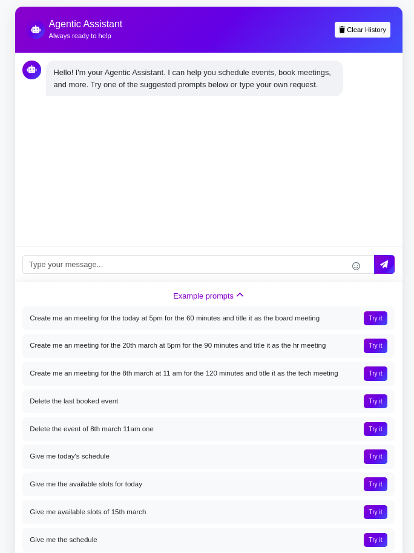
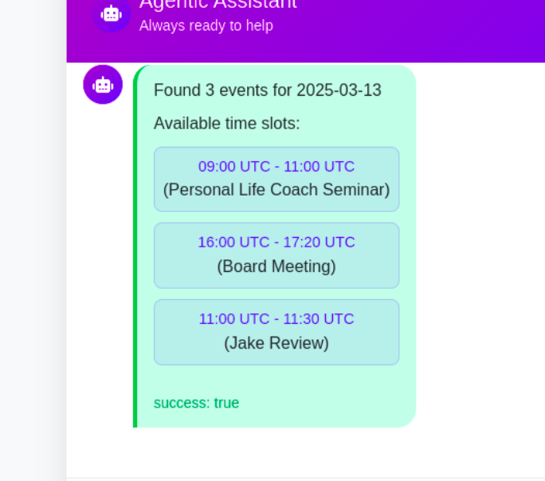

# CrewAI Calendar Bot — Voice-to-Voice Scheduling Assistant

A smart, **CrewAI-powered voice assistant** that helps you manage your Google Calendar using natural **voice conversations**. This assistant is built around a **single agent** that performs **multiple scheduling tasks** using specialized tools — all wrapped in a Flask backend with a lightweight **HTML frontend**. It uses **AssemblyAI** for speech recognition and **Eleven Labs** for speech synthesis, enabling seamless voice-to-voice scheduling. An **automatic microphone control** ensures the mic stops listening when not in use.

---

## 🧠 Core Concept

This system features **one intelligent CrewAI agent** that coordinates all calendar tasks using a task-tool structure. The interaction starts with your **voice input**, which is transcribed using **AssemblyAI**, processed by the agent, and then converted back to speech using **Eleven Labs** — giving you a fully automated **voice-to-voice experience**.

---

  


## 🔑 Key Features

- 🧠 One CrewAI agent orchestrating multiple calendar tasks
- 🎙️ **Voice-to-voice** interaction via:
  - 🗣 **AssemblyAI** (Automatic Speech Recognition)
  - 🧏 **Eleven Labs** (Text-to-Speech)
- 🎚️ **Automatic mic stop** when voice input ends or after inactivity
- 📅 Google Calendar integration
- 💬 Gemini API for intent understanding
- 🛠️ Tool-based task execution (event creation, availability check, reminders, etc.)
- 🌐 Flask backend for API endpoints
- 💻 Simple HTML frontend for browser interaction
- 🌍 Time zone support
- 🔔 Reminder scheduling and alerts

---

## 🧩 System Architecture

```
┌──────────────────────┐
│    HTML Frontend     │
│ (Mic + Voice Output) │
└─────────▲────────────┘
          │
  🎙️ User speaks
          │
          ▼
┌──────────────────────┐
│    AssemblyAI ASR    │  ← 🎧 Speech-to-text
└─────────▲────────────┘
          │
      Transcribed Text
          │
          ▼
┌─────────────────────────────┐
│     Flask API + CrewAI      │
│ - Parse Intent (Gemini API) │
│ - Execute Tool              │
│ - Generate Response Text    │
└─────────▲────────────┬──────┘
          │            │
          │            └──▶ Google Calendar API
          │
    Response Text
          ▼
┌──────────────────────┐
│   Eleven Labs TTS    │  ← 🔊 Text-to-speech
└─────────▼────────────┘
          │
   🔈 Response Audio
          ▼
     Played to User
```

Includes:  
✅ **Auto mic stop logic** after silence/inactivity  
✅ **Voice-first UX** from start to end

---

## 🚀 Setup

### 1. Clone the Repository

```bash
git clone https://github.com/neeldevenshah/crewai-voice-calendar-bot.git
cd crewai-voice-calendar-bot
```

---

### 2. Backend Setup (Python, Flask, CrewAI)

#### Environment Setup

```bash
python -m venv venv
source venv/bin/activate
pip install -r requirements.txt
```

#### `config.json`

```json
{
  "timezone": "Asia/Riyadh",
  "reminder_minutes": 30,
  "default_meeting_duration": 60,
  "gemini_api_key": "your-gemini-api-key",
  "assemblyai_api_key": "your-assemblyai-api-key",
  "elevenlabs_api_key": "your-elevenlabs-api-key"
}
```

#### Google Calendar Setup

- Enable **Google Calendar API** in [Google Cloud Console](https://console.cloud.google.com/)
- Download OAuth credentials and save as `credentials.json` in the project root

---

### 3. HTML Frontend

Open `frontend/index.html` in your browser.

- Starts mic on button click
- Stops automatically after voice ends
- Sends audio to Flask backend for processing

Ensure it connects to the Flask backend at `http://localhost:5000`.

---

### 4. Run the Bot

```bash
python main.py
```

---

## 🎤 Example Voice Commands

| Spoken Command                              | Agent Task Triggered    |
| ------------------------------------------- | ----------------------- |
| “Schedule a call with Ali tomorrow at 11am” | `AddEventTool`          |
| “Do I have time on Thursday at 3pm?”        | `CheckAvailabilityTool` |
| “What’s on my calendar today?”              | `ViewEventsTool`        |

---

## 🛠 Tool-Based Agent Design

All functionalities are modular and delegated to **CrewAI tools**:

- `AddEventTool`
- `CheckAvailabilityTool`
- `ViewEventsTool`
- `ParseIntentTool` (powered by Gemini)

This modular design keeps the system **flexible, scalable, and easy to maintain**.

---

## 📄 License

This project is licensed under the MIT License.
